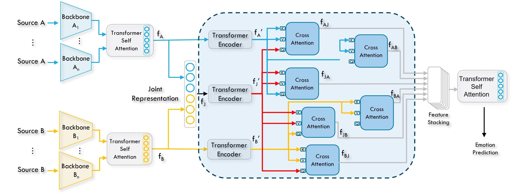

# [Joint Multimodal Transformer for Emotion Recognition in the Wild](https://arxiv.org/pdf/2403.10488.pdf)


by **Paul Waligora<sup>1</sup>, Haseeb Aslam<sup>1</sup>, Osama 
Zeeshan<sup>1</sup>, Soufiane Belharbi<sup>1</sup>, Alessandro
Lameiras Koerich<sup>1</sup>, Marco Pedersoli<sup>1</sup>, Simon
Bacon<sup>2</sup>, Eric Granger<sup>1</sup>**

<sup>1</sup> LIVIA, Dept. of Systems Engineering, ÉTS, Montreal, Canada
<br/>
<sup>2</sup> Dept. of Health, Kinesiology \& Applied Physiology, Concordia University, Montreal, Canada

<p align="center"></p>


## Abstract
Multimodal emotion recognition (MMER) systems typically
outperform unimodal systems by leveraging the inter-
and intra-modal relationships between, e.g., visual, textual,
physiological, and auditory modalities. This paper
proposes an MMER method that relies on a joint multimodal 
transformer (JMT) for fusion with key-based cross-attention. 
This framework can exploit the complementary
nature of diverse modalities to improve predictive accuracy. 
Separate backbones capture intra-modal spatiotemporal 
dependencies within each modality over video sequences. 
Subsequently, our JMT fusion architecture integrates 
the individual modality embeddings, allowing the
model to effectively capture inter- and intra-modal relationships. 
Extensive experiments on two challenging expression 
recognition tasks – (1) dimensional emotion recognition
on the Affwild2 dataset (with face and voice) and
(2) pain estimation on the Biovid dataset (with face and
biosensors) – indicate that our JMT fusion can provide a
cost-effective solution for MMER. Empirical results show
that MMER systems with our proposed fusion allow us to
outperform relevant baseline and state-of-the-art methods.

**Code: Pytorch 1.9.0**, made for the [6th-ABAW challenge](https://affective-behavior-analysis-in-the-wild.github.io/6th/index.html).


## Citation:
```
@InProceedings{Waligora-abaw-24,
  title={Joint Multimodal Transformer for Emotion Recognition in the Wild},
  author={Waligora, P. and Aslam, H. and Zeeshan, O. and Belharbi, S. and
  Koerich, A. L. and Pedersoli, M. and Bacon, S. and Granger, E.},
  booktitle={CVPRw},
  year={2024}
}
```

## Installation of the environment
```bash
cd Transformer_fusion
conda create --name myenv --file requirements.txt
conda activate YOUR_ENV_NAME
```

## Supported modalities and backbones:
- Vision: `I3D`, `R2D`.
- Audio: `ResNet18`, `wavLM` (features)

## Training with fusion:
```bash
#!/usr/bin/env bash

CONDA_BASE=$(conda info --base)
source $CONDA_BASE/etc/profile.d/conda.sh
conda activate YOUR_ENV_NAME

# ==============================================================================
cudaid=$1
export CUDA_VISIBLE_DEVICES=$cudaid

python main.py \
       --opt__name_optimizer sgd \
       --opt__lr 0.0001 \
       --opt__weight_decay 0.0 \
       --opt__name_lr_scheduler mystep \
       --opt__step_size 100 \
       --opt__gamma 0.1 \
       --v_dropout 0.0 \
       --a_dropout 0.0 \
       --num_heads 1 \
       --num_layers 1 \
       --freeze_vision_R2D1 True \
       --freeze_vision_I3D True \
       --freeze_audio_ResNet18 True \
       --split DEFAULT \
       --l_vision_backbones R2D1 \
       --l_audio_backbones wavLM+ResNet18 \
       --init_w_R2D1 KINETICS400 \
       --init_w_I3D KINETICS400 \
       --init_w_ResNet18 IMAGENET \
       --goal TRAINING \
       --train_params__take_n_videos 2 \
       --val_params__take_n_videos 2 \
       --R2D1_ft_dim_reduce MAX \
       --joint_modalities TRANSFORMER \
       --dump_best_model_every_time True \
       --output_format SELF_ATTEN \
       --intra_modal_fusion encoder_plus_self_attention \
       --max_epochs 1 \
       --train_params__seq_length 512 \
       --train_params__subseq_length 32 \
       --train_params__stride 1 \
       --train_params__dilation 4 \
       --train_params__batch_size 32 \
       --train_params__num_workers 16 \
       --train_params__pin_memory True \
       --train_params__shuffle True \
       --train_params__use_more_vision_data_augm False \
       --train_params__use_more_audio_data_augm False \
       --val_params__num_workers 8 \
       --SEED 0 \
       --Mode Training \
       --exp_id 03_09_2024_10_20_28_318104__2676163
```

## Pretraining a backbone:
```bash
#!/usr/bin/env bash

CONDA_BASE=$(conda info --base)
source $CONDA_BASE/etc/profile.d/conda.sh
conda activate YOUR_ENV_NAME

# ==============================================================================
cudaid=$1
export CUDA_VISIBLE_DEVICES=$cudaid

python main.py \
       --opt__name_optimizer sgd \
       --opt__lr 0.0001 \
       --opt__weight_decay 0.0 \
       --opt__name_lr_scheduler mystep \
       --opt__step_size 100 \
       --opt__gamma 0.1 \
       --v_dropout 0.15 \
       --a_dropout 0.15 \
       --num_heads 1 \
       --num_layers 1 \
       --freeze_vision_R2D1 False \
       --freeze_vision_I3D True \
       --freeze_audio_ResNet18 True \
       --split DEFAULT \
       --l_vision_backbones R2D1 \
       --l_audio_backbones None \
       --init_w_R2D1 KINETICS400 \
       --init_w_I3D KINETICS400 \
       --init_w_ResNet18 IMAGENET \
       --goal PRETRAINING \
       --train_params__take_n_videos -1 \
       --val_params__take_n_videos -1 \
       --R2D1_ft_dim_reduce MAX \
       --use_joint_representation True \
       --dump_best_model_every_time True \
       --output_format SELF_ATTEN \
       --max_epochs 5 \
       --train_params__seq_length 512 \
       --train_params__subseq_length 32 \
       --train_params__stride 1 \
       --train_params__dilation 4 \
       --train_params__batch_size 32 \
       --train_params__num_workers 8 \
       --train_params__pin_memory True \
       --train_params__shuffle True \
       --train_params__use_more_vision_data_augm False \
       --train_params__use_more_audio_data_augm False \
       --val_params__num_workers 8 \
       --SEED 0 \
       --Mode Training \
       --exp_id 03_09_2024_10_20_28_318104__2676163
```

## Testing:

```bash
#!/usr/bin/env bash

CONDA_BASE=$(conda info --base)
source $CONDA_BASE/etc/profile.d/conda.sh
conda activate YOUR_ENV_NAME

# ==============================================================================
cudaid=$1
export CUDA_VISIBLE_DEVICES=$cudaid

python main.py \
       --Mode Eval \
       --eval_set test \
       --fd_exp ABSOLUTE_PATH_TO_THE_EXP_FOLDER
```
